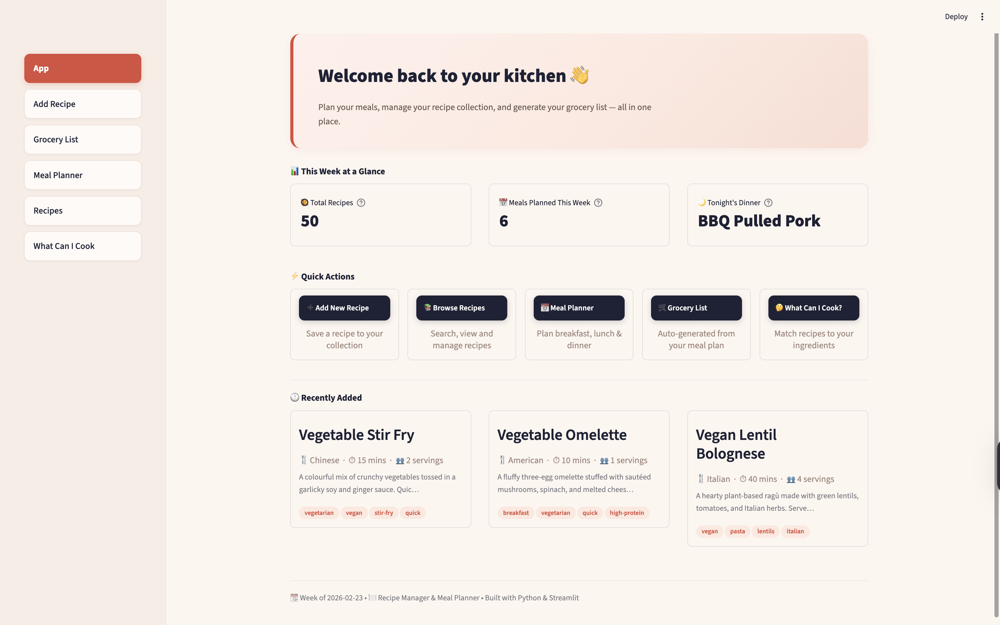
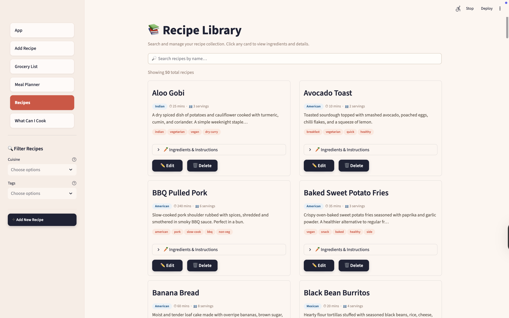
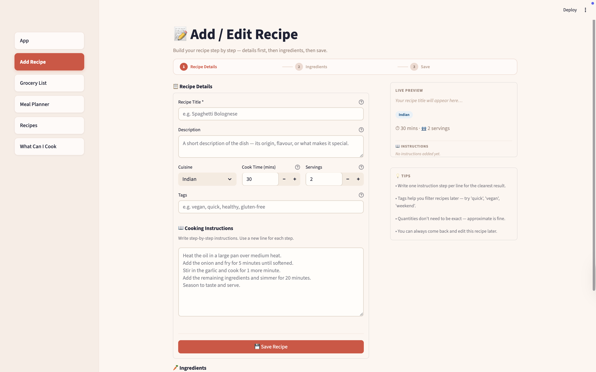
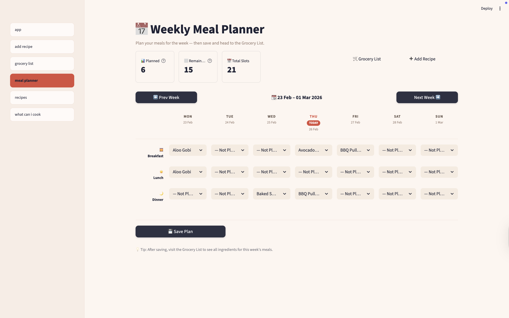
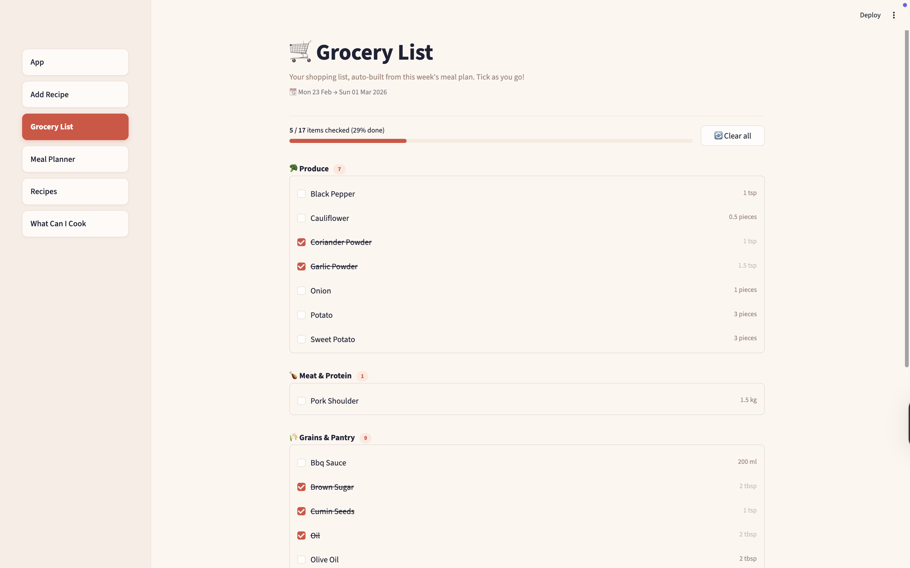
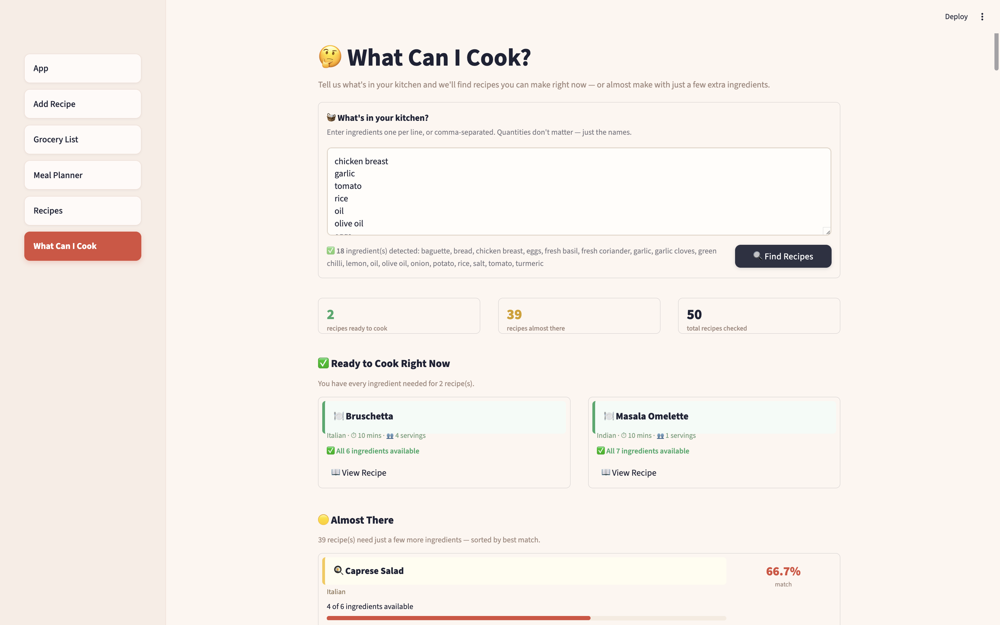

# 🍳 Recipe Manager & Meal Planner

A full-featured desktop web app for managing your personal recipe collection, planning meals for the week, and automatically generating a smart grocery list — built entirely in Python.

---

## 📸 Screenshots

### 🏠 Home Dashboard

*Live metrics, quick navigation, and recently added recipes at a glance.*

### 📚 Recipe Library

*50 recipes displayed as clean cards with cuisine badges, tags, cook time, and expandable ingredient lists.*

### ➕ Add / Edit Recipe

*Step-by-step form with a live preview panel, dynamic ingredient rows, and cooking instructions.*

### 📅 Weekly Meal Planner

*Full week grid with Breakfast, Lunch, and Dinner slots. Today is highlighted. Saves with one click.*

### 🛒 Grocery List

*Auto-generated from your meal plan. Ingredients merged and totalled across recipes, grouped by category, checkable as you shop.*

### 🤔 What Can I Cook?

*Enter ingredients you have — get instant full matches and ranked partial matches with missing ingredients shown clearly.*

---

## ✨ Features

- **Recipe Library** — Add, edit, and delete recipes with title, description, cuisine, cook time, servings, tags, ingredients, and cooking instructions. Search and filter by cuisine or tag.
- **Meal Planner** — A weekly calendar grid (Mon–Sun × Breakfast/Lunch/Dinner) to assign recipes to each meal slot. Navigate between weeks. Today's column is highlighted.
- **Smart Grocery List** — Auto-generates a merged grocery list from your weekly meal plan. Duplicate ingredients across recipes are combined and totalled. Items grouped by category (Produce, Meat & Protein, Grains & Pantry, Dairy) and checkable as you shop.
- **What Can I Cook?** — Enter ingredients you have at home and get instant recipe matches. Full matches shown first; partial matches ranked by percentage with missing ingredients shown as chips.
- **50 Starter Recipes** — Pre-loaded dataset across Indian, Italian, Mexican, Chinese, Thai, Mediterranean, American, vegetarian, vegan, breakfast, snacks, and desserts.
- **Warm Coral UI** — Custom Streamlit theme with styled cards, dark action buttons, cuisine badges, tag chips, and a consistent sidebar across all pages.

---

## 🛠️ Tech Stack

| Layer | Technology |
|---|---|
| Language | Python 3.10+ |
| UI Framework | Streamlit |
| Database | SQLite (via Python's built-in `sqlite3`) |
| Styling | Streamlit theming (`config.toml`) + custom CSS |
| Version Control | Git & GitHub |

No external database setup required. Everything runs locally from a single `.db` file.

---

## 🚀 Getting Started

### 1. Clone the repository

```bash
git clone https://github.com/anurag290805/Recipe-meal-planner.git
cd Recipe-meal-planner
```

### 2. Create and activate a virtual environment

```bash
python3 -m venv venv
source venv/bin/activate       # Mac/Linux
venv\Scripts\activate          # Windows
```

### 3. Install dependencies

```bash
pip install streamlit
```

### 4. Seed the database with starter recipes

```bash
python3 seed_data.py
```

### 5. Run the app

```bash
streamlit run app.py
```

The app will open automatically at `http://localhost:8501`.

---

## 📁 Project Structure

```
recipe-planner/
│
├── app.py                    # Home dashboard (entry point)
├── database.py               # All database logic (SQLite)
├── global_styles.py          # Shared CSS injected across pages
├── seed_data.py              # Seeds 50 starter recipes
│
├── pages/
│   ├── add_recipe.py         # Add & edit recipes
│   ├── recipes.py            # Browse recipe library
│   ├── meal_planner.py       # Weekly meal planner
│   ├── grocery_list.py       # Auto-generated grocery list
│   └── what_can_i_cook.py    # Ingredient-based recipe matcher
│
└── .streamlit/
    └── config.toml           # Global theme configuration
```

---

## 🧠 Key Technical Highlights

**Relational database design** — Three linked SQLite tables (`recipes`, `ingredients`, `meal_plan`) with foreign key constraints and cascade deletes. All database access is centralised in `database.py` — no page contains raw SQL.

**Ingredient merging algorithm** — The grocery list aggregates ingredients across all planned recipes, combining duplicates and summing quantities in pure Python using dictionaries and string normalisation.

**Ingredient matching logic** — The "What Can I Cook?" feature uses Python sets to compute full and partial matches against every recipe, ranked by match percentage. Missing ingredients are highlighted clearly.

**Dynamic form state** — The Add Recipe page uses `st.session_state` to manage a variable number of ingredient rows that persist across Streamlit reruns without resetting.

**Multi-page architecture** — Streamlit's native `pages/` folder handles routing automatically. Shared styles are injected via `global_styles.py` so every page looks consistent.

---

## 📋 What I Learned

- Structuring a Python project across multiple modules with clean separation of concerns
- Creating and querying a relational SQLite database with parameterised queries
- Building interactive multi-page UIs with Streamlit (forms, session state, dynamic elements)
- Writing data aggregation logic for real-world use cases (ingredient merging, set-based matching)
- Using Git for version control and GitHub for project presentation

---

## 👤 Author

**Anurag Srivastava**  
[GitHub](https://github.com/anurag290805)
